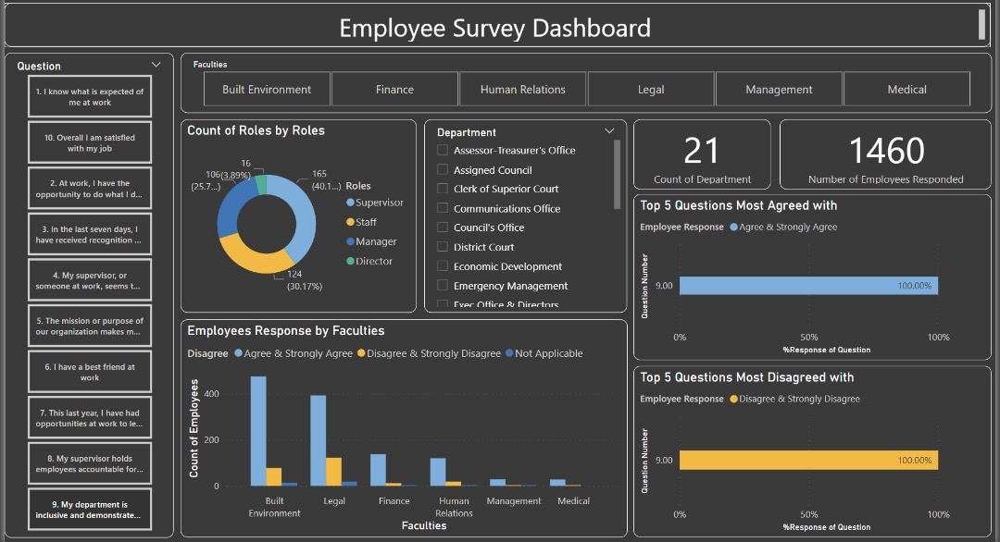

# Employee-Survey

## Introduction
The Employee Survey Responses are actual responses from an employee engagement survey conducted by Pierce County WA and completed voluntarily by government employees.

## Tools and Skills
### Tools

PowerBI- Data Cleaning, Data Analysis & Creating Report
Skills

The following Power BI skills were incorporated-

- DAX
- Conditional Columns
- Filters
- Slicers

## Data Cleaning

In the data cleaning phase, I performed the following tasks:

- Data loading and inspection
- Data cleaning and formatting

## Exploratory Data Analysis

EDA involved exploring the survey results to answer key questions, such as: 

- Which survey questions did respondents agree with or disagree with most?
- Are there any patterns or trends by department or role?
- What steps might an entrepreneur take to improve employee satisfaction based on the survey results?

## Results /Findings
1. The top question most agreed with was: "1. I know what is expected of me at work." And the mist disagreed with was: "6. I have a best friend at work". This implies that most emoloyees have a clear understanding of their job description, but maintain a formal relationship on the workplace.
2. I grouped the departments into 6 faculties namely; Built Enviroment, Legal, Finance, Management, and Medical. This grouping was done based on the nature of the job done. The Legal Departments were most dissatisfied with their job and received the least recignition or praise for doing a good job. However, they reported the highest number of disagreement to having a best friend at work. This suggests that there exists low camaraderie among the employees, but good relationship between supervisors and supervuseed, regardless of their feelings of dissatisfaction towards their occupation.
3. Majority of employees in Human Relations, Management, amd Medical reported that they have had opportunites for career growth in the last year. The legal departments recorded the highest dusagreements to this.
4. Most inclusive department is the Planning and Public Works Department.

## Recommendations
An employer seeking to improve employee satisfaction may do the following:
1. Provide more recognition and praise to the Legal Department for their work to address dissatisfaction via incentives/company awards.
2. Carry out team building exercises/retreats to encourage camaraderie among employees across departments to foster a supportive workplace culture.
3. Emulate the inclusive practices of the Planning and Public Works Department to promote a sense of belonging and inclusivity across all departments.

## Limitations
I classified the 21 departments into 6 faculties according to the nature of their jobs.
